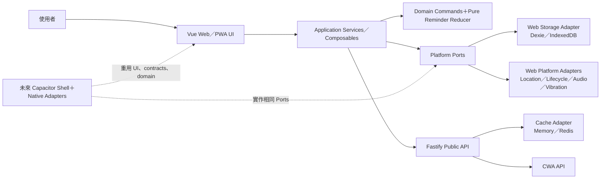

# 防曬晴報員 P0 Technical Design Document

| 文件資訊 | 內容 |
| --- | --- |
| 對應 PRD | `防曬晴報員PRD.md` v3.11 |
| Release Manifest | `P0_RELEASE_MANIFEST.md` v0.3 |
| Screen Inventory | `P0_SCREEN_INVENTORY.md` v0.5 |
| Reminder Rules | `P0_REMINDER_RULE_DECISION_TABLE.md` v0.3 |
| Copy Deck | `P0_COPY_DECK.md` v0.5 |
| Requirement Traceability Matrix | `P0_REQUIREMENT_TRACEABILITY_MATRIX.md` v0.8 |
| 文件版本 | 0.8 |
| 狀態 | Phase 0、Phase 1 核心、Phase 2 foundation／SetupDraft 與 Phase 3 Web Shell／S-01／S-03～S-07 local slice 已實作並通過目前自動 Gate；完整 P0 發布仍受未完成流程與專業審查 Gate 約束 |
| 架構決策 | Web／PWA first，Capacitor-ready |
| 建立日期 | 2026-07-29 |
| 最近更新 | 2026-08-07 |

> 本文件把既有產品規格轉成可實作、可測試、可部署的技術設計，不新增產品功能、醫療推論或提醒分鐘數。若與 PRD、P0 Release Manifest 或 Reminder Rule Decision Table 衝突，必須先修正本文件，不得用工程實作覆蓋上游安全規格。

---

## 1. 白話摘要

P0 會交付一個真正可使用的響應式 Web App，使用者可以：

- 直接用瀏覽器開啟。
- 選擇安裝成 PWA，從手機主畫面啟動。
- 離線查看已快取的 App Shell、說明內容及目前裝置保存的提醒資料。
- 關閉後再次開啟，依保存的絕對時間重新計算提醒狀態。

`Capacitor-ready` 不代表 P0 現在就要製作 App Store／Google Play 版本，而是從第一天避免把核心功能綁死在瀏覽器。未來需要原生 App 時，可沿用：

- TypeScript 提醒規則與固定測試向量。
- 事件、命令與 API schema。
- 大部分 Vue 畫面、表單與 Design Tokens。
- 後端 CWA、地區與可信時間 API。

未來需要另外適配的是：

- 原生通知、定位、震動與 App lifecycle。
- App 內資料庫與既有 PWA Guest 資料轉移政策。
- iOS／Android 簽章、商店素材、權限說明與實機驗收。

Web／PWA 與原生 App 可以長期並存，不需要關閉 Web 才能推出 App。

---

## 2. 文件權威與範圍

### 2.1 文件優先順序

發生衝突時依下列順序處理：

1. `防曬晴報員PRD.md`：產品目的、安全邊界、資料模型與驗收條件。
2. `P0_RELEASE_MANIFEST.md`：P0 實際交付範圍。
3. `P0_REMINDER_RULE_DECISION_TABLE.md`：提醒 reducer、ruleId 與固定測試向量。
4. `P0_SCREEN_INVENTORY.md`：畫面任務、狀態與轉場。
5. `P0_COPY_DECK.md`：使用者文案、reasonCode 映射與審查狀態。
6. 本 TDD：工程結構與實作方式。

Requirement Traceability Matrix 用來追蹤上述文件及實作證據，不凌駕來源規格。

### 2.2 P0 包含

- Vue Web App 與 PWA。
- Guest 本機產品、Session、事件、提醒狀態與設定草稿。
- 純 TypeScript reminder reducer。
- IndexedDB／Dexie transaction、migration、revision CAS 與多 context 協調。
- CWA 觀測、區域預報、RegionUvMapping 與 freshness。
- `/v1/time` 可信時間校準。
- P0 前景視覺提醒；使用者明確啟用後才嘗試短提示音／震動。
- P0 Screen Inventory 的 S-01～S-20。
- P0 自動化測試、實機驗收與發布 Gate。

### 2.3 P0 不包含

- Capacitor iOS／Android binary。
- 帳號、登入、Guest migration、跨裝置同步。
- Web Push、LINE、Email 或原生遠端通知。
- P1 Notification Job／Bundle／Destination／Delivery。
- AI 標籤辨識、相機、背景 GPS、geofence。
- Widget、Live Activities、Siri、Google App Actions。
- P0.5 公開文章、完整 UV知識庫、SEO／AEO。
- `general_unlocalized` 整體提醒模式。

---

## 3. Architecture Decision Records

| ID | 決策 | 理由 | 後續影響 |
| --- | --- | --- | --- |
| TD-ARCH-001 | Web／PWA first，Capacitor-ready | 先以最低發行成本驗證核心提醒；保留轉 App 能力 | P0 不建立 native project，但平台能力一律經介面呼叫 |
| TD-ARCH-002 | pnpm TypeScript monorepo | Web、API、schema、reducer 與測試向量需共用 | 禁止複製一份前端 reducer 再為後端重寫 |
| TD-ARCH-003 | Guest 採本機 event truth＋可重建 projection | 符合 PRD 的稽核、更正與離線要求 | `ProtectionZoneState` 可刪除重建，不是事件真值 |
| TD-ARCH-004 | reducer 為同步、純函式 | 可重現、可共用、可用固定向量驗證 | 不得讀 `Date.now()`、Vue state、IndexedDB、CWA 或瀏覽器 API |
| TD-ARCH-005 | 平台採 Ports／Adapters | Web API 與 Capacitor API 不同 | `window`、`navigator`、Dexie、Capacitor import 不得進 domain |
| TD-ARCH-006 | P0 Web 為 SPA＋靜態資產部署 | P0 是封閉 Core Beta，無公開 SEO 需求 | P0.5 公開內容的 SSR／SSG 另立 ADR，不把複雜度提前帶入 P0 |
| TD-ARCH-007 | PWA 使用 `vite-plugin-pwa`＋Workbox `generateSW` | P0 只需 App Shell／靜態內容離線，不需自訂 push worker | P1 若選 Web Push，再評估 `injectManifest` |
| TD-ARCH-008 | 所有 `/v1/*` 不由 Service Worker 快取 | 時間、定位、freshness 必須由明確邏輯處理 | UVI 離線快照只存在 IndexedDB；`/v1/time` 永遠 Network Only |
| TD-ARCH-009 | P0 不預設導入 Pinia | domain truth 在事件庫，route view 只需 feature composables | 若日後加入，只能管理 UI／orchestration，不得成為第二份 domain truth |
| TD-ARCH-010 | P0 不導入 Ionic UI | 已有自己的 Screen、Copy 與 Design Token 規格 | 未來 Capacitor 可包裝同一套 Vue UI，不必更換元件系統 |
| TD-ARCH-011 | 前端與 API 分離部署，生產環境優先同 origin 反向代理 | 靜態資產與 API 可獨立擴展，同 origin 可降低 CORS 複雜度 | 若部署為不同 origin，使用精確 allowlist，禁止 `*` |
| TD-ARCH-012 | 版本使用鎖檔，不在本文件寫浮動最新版 | 生態版本會變動 | 專案建立時選仍受支援的穩定版並提交 lockfile、Node 版本檔與 engines |
| TD-ARCH-013 | P0 視覺基礎採「Studio Mono」黑白灰；Tracking 使用資訊藍 | 依 2026-07-30 選定的 IRKA 網站配色原則建立高對比工具介面；品牌骨架與 Reminder 語意色分離 | 只參考色彩原則，不複製 IRKA 標誌、排版或互動識別；綠色只用於 transaction feedback，不得表示防護安全、有效或倒數仍可信 |

---

## 4. 技術棧

### 4.1 Web

| 層級 | 選擇 | 用途 |
| --- | --- | --- |
| Framework | Vue 3 | 畫面與互動 |
| Vue 寫法 | Composition API、`<script setup lang="ts">` | 明確型別、功能邏輯可抽成 composables |
| Build | Vite | 開發、建置與 code splitting |
| Routing | Vue Router | S-01～S-20 route 與 route guard |
| PWA | `vite-plugin-pwa`＋Workbox | manifest、App Shell、靜態內容離線與更新提示 |
| Local database | IndexedDB＋Dexie | Guest 事件、產品、projection、草稿與校準資料 |
| Runtime validation | Zod | 命令、事件、API、內容 bundle 與 migration 驗證 |
| Styling | CSS Custom Properties＋Vue scoped CSS | 日間高對比／系統／夜間 tokens 與元件樣式 |
| Time display | `Intl.DateTimeFormat` | 依使用者時區呈現；domain 只計算 UTC instant |

Vue 規則：

- route view 只負責組合 feature，不直接操作 IndexedDB 或瀏覽器 API。
- source state 保持最小；可推導資料使用 `computed`。
- `watch` 只做副作用，例如持久化明確偏好或因 route 變化重新查詢。
- Props 向下、Events 向上；公開 props／emits 必須有 TypeScript contract。
- 不使用 `v-html` 呈現未受信內容。
- 元件內順序固定為 `<script setup>`、`<template>`、`<style scoped>`。

#### 4.1.1 視覺設計基礎：Studio Mono

選定日期：2026-07-30。

品牌 primitive 工作值：

| Token | 工作值 | 用途限制 |
| --- | --- | --- |
| `--color-paper` | `#F9F9F9` | 日間頁面背景 |
| `--color-surface` | `#FFFFFF` | 卡片與主要 surface |
| `--color-ink` | `#121212` | 主文字、主要 CTA、品牌骨架 |
| `--color-dark` | `#121817` | 深色 surface 與 inverse CTA |
| `--color-deep` | `#0B0B0B` | 沉浸深色區塊 |
| `--color-text-secondary` | `#5A5A5A` | 一般次要文字 |
| `--color-decoration-muted` | `#8F8F8F` | 只供大型裝飾或非必要資訊；不得作小型正文 |
| `--color-line` | `#E3E3E3` | 分隔線與低對比邊界 |

Reminder semantic token 工作值：

| 狀態 | Surface | Emphasis | Text | 語意 |
| --- | --- | --- | --- | --- |
| Tracking | `#EAF3FC` | `#2F6FBB` | `--text-primary` | 資訊／提醒運作中，不代表安全 |
| Reapply soon | `#FFF3D6` | `#A86100` | `--text-primary` | 即將需要注意 |
| Reapply due | `#FDECEA` | `#CC3333` | `--text-primary` | 現在需要採取行動；沿用選定配色的少量提示紅 |
| Untimed action | `#F1EDFF` | `#5B3CC4` | `--text-primary` | 無可信時間或資料待確認 |
| Transaction success | `#E9F7F1` | `#147D64` | `--text-primary` | 只表示儲存／提交成功 |

深色模式 semantic 值（2026-08-05 補入，實作見 `packages/ui/src/styles.css`）：

| 狀態 | 深色 Emphasis | 深色 Surface |
| --- | --- | --- |
| Tracking | `#6BA3E0` | `#17293D` |
| Reapply soon | `#E0A23F` | `#3A2A11` |
| Reapply due | `#E2585F` | `#3C1C1E` |
| Untimed action | `#A084E8` | `#271F42` |
| Transaction success | `#35C19A` | `#143329` |

深色中性色：`--page-background` `#0F0E0C`、`--surface-primary` `#1C1A17`、
`--text-primary` `#F5F3EF`、`--text-secondary` `#A8A29B`、
`--border-subtle` `rgb(255 250 240 / 12%)`。深色不得使用純黑或純白。

UVI 風險色（淺／深）：low `#507AA8`／`#6F9BD4`、moderate `#BD8500`／`#E0AB35`、
high `#D16627`／`#E3803E`、very-high `#C43D3D`／`#E0555A`、
extreme `#7D4BB3`／`#A878E0`。

深色值不得由淺色值直接沿用：同一色值在近黑背景上會因同時對比效應顯得洗白，
每組都必須重新提高明度與飽和度。

限制：

- 綠色不得表示皮膚安全、產品仍有效、期限可信或不需行動。
- `tracking` 不得使用綠色或「安全」「有效防護中」等保證性語言，
  也不得用勾勾圖示**表示狀態**。動作按鈕上的確認圖示（例如「記錄已補擦」
  按鈕內的 check）屬於操作 affordance，不在此限。
  （2026-08-05 裁決；原條文一律禁止勾勾圖示，與實作不符。）
- **顏色不得是狀態的唯一載體**，必須另有文字、可及名稱或形狀承載相同資訊。
  原條文要求「同時搭配文字、圖示、邊框或形狀」，指定了手段而非結果，
  與「結構性區塊一律無框」的版面規則衝突；2026-08-05 改為只要求結果。
  驗證方式：把畫面轉成灰階，狀態是否仍可辨識。
- `timed_ring` 只使用 Tracking／Reapply soon 的可信時間；Due 與
  Untimed 使用靜態卡片。
- 元件只能引用 semantic／component token，不得直接引用 hex primitive。
- 字級只使用 `--font-size-page-title｜section-title｜body｜label｜caption`
  五個變數，不得寫死中間值；詳見 `DESIGN_SYSTEM.md` 規則 1。
- `#8F8F8F` 對 `#F9F9F9` 的對比不足以作一般小字；實作使用
  `#5A5A5A` 作可讀次要文字。
- daylight 與 dark／system mode 使用獨立 semantic mapping，不做單純反相。
- 正式 token 進 production 前必須通過 WCAG contrast、自動化檢查及戶外
  Android／iPhone 實機可讀性測試。

### 4.2 API

| 層級 | 選擇 | 用途 |
| --- | --- | --- |
| Runtime | 受支援的 Node.js Active LTS | API 執行環境 |
| Framework | Fastify＋TypeScript | 公共 API、validation、logging、health |
| Schema | 共用 Zod contracts | Web 與 API 使用相同 input／output contract |
| Cache Port | 開發記憶體、正式環境 Redis-compatible adapter | CWA dataset cache、single-flight 與 freshness metadata |
| Logging | Fastify 結構化 logger＋欄位遮罩 | requestId、錯誤率、CWA 指標；禁止敏感 payload |

正式選定依賴版本時：

1. 固定 Node 版本於 `.node-version` 或等效檔案。
2. `package.json.engines` 與 CI 使用相同 major。
3. 提交 `pnpm-lock.yaml`。
4. Renovate／Dependabot 類工具只能提出 PR，不得自動發布安全規則變更。
5. Vue、Dexie、Workbox、Capacitor major 升級必須跑完整 regression。

### 4.3 測試與品質

| 類型 | 工具 |
| --- | --- |
| Unit／contract | Vitest |
| Vue component | Vue Test Utils＋Vitest |
| Property-based | `fast-check`＋Vitest |
| IndexedDB integration | Dexie＋`fake-indexeddb`，另跑真實瀏覽器測試 |
| API integration | Fastify `inject()` |
| E2E | Playwright |
| Accessibility automation | `@axe-core/playwright` 或等效工具 |
| Type check | `vue-tsc`＋TypeScript |
| Lint／format | ESLint＋Prettier；實際版本與規則鎖定於 repo |

自動模擬不能取代 iPhone Safari、Android Chrome、安裝後 PWA、戶外可讀性及系統能力實機測試。

---

## 5. 系統全貌



依賴方向只能往內：

```text
Vue pages/components
  → application composables/services
    → domain + contracts

web adapters / future capacitor adapters
  → platform ports + contracts

domain
  → 不依賴 Vue、Dexie、Fastify、Workbox、Capacitor 或瀏覽器 global
```

---

## 6. Monorepo 與目錄

預定結構：

```text
/
├─ apps/
│  ├─ web/
│  │  ├─ src/
│  │  │  ├─ app/
│  │  │  ├─ router/
│  │  │  ├─ pages/
│  │  │  ├─ features/
│  │  │  ├─ components/
│  │  │  ├─ composables/
│  │  │  ├─ adapters/
│  │  │  ├─ styles/
│  │  │  └─ main.ts
│  │  ├─ public/
│  │  └─ vite.config.ts
│  └─ api/
│     └─ src/
│        ├─ app.ts
│        ├─ routes/
│        ├─ cwa/
│        ├─ cache/
│        ├─ mapping/
│        ├─ observability/
│        └─ server.ts
├─ packages/
│  ├─ contracts/
│  │  └─ src/
│  │     ├─ api/
│  │     ├─ commands/
│  │     ├─ events/
│  │     ├─ content/
│  │     └─ versions/
│  ├─ domain/
│  │  └─ src/
│  │     ├─ reducer/
│  │     ├─ rules/
│  │     ├─ corrections/
│  │     ├─ water/
│  │     ├─ clock/
│  │     └─ projections/
│  ├─ platform/
│  │  └─ src/ports/
│  ├─ persistence-web/
│  │  └─ src/
│  │     ├─ db/
│  │     ├─ migrations/
│  │     ├─ repositories/
│  │     └─ transactions/
│  ├─ content/
│  │  └─ src/
│  │     ├─ copy/zh-TW/
│  │     ├─ claims/
│  │     ├─ rulesets/
│  │     └─ build-gates/
│  ├─ ui/
│  │  └─ src/
│  │     ├─ primitives/
│  │     ├─ status/
│  │     └─ tokens/
│  └─ test-fixtures/
│     └─ src/
│        ├─ reminder-vectors/
│        ├─ cwa/
│        └─ clocks/
├─ tests/
│  ├─ integration/
│  ├─ e2e/
│  ├─ accessibility/
│  └─ evidence/
├─ pnpm-workspace.yaml
├─ package.json
├─ tsconfig.base.json
└─ pnpm-lock.yaml
```

未來才新增：

```text
apps/mobile/
packages/platform-capacitor/
```

P0 不先加入空的 Capacitor binary、iOS project 或 Android project。

---

## 7. Vue 畫面與元件邊界

### 7.1 Route views

S-01～S-20 各自有一個 route view。View 只負責：

- 讀取 route params。
- 呼叫對應 feature composable。
- 組合 feature 元件。
- 呈現 boot／loading／empty／error／offline 邊界。
- 在 route 改變後將焦點移到頁面標題。

View 不得：

- 直接呼叫 Dexie。
- 直接呼叫 `navigator.geolocation`、`navigator.vibrate` 或 Service Worker。
- 自行重算提醒規則。
- 把 Copy Deck 文字硬寫進 domain 判斷。

### 7.2 Component map

> 2026-08-05 依實際程式碼重寫。先前版本停留在規劃階段的命名：
> `TimedReminderRing`／`DueStatusCard`／`UntimedActionCard` 已合併為單一
> `ReminderPanel`（commit 81f1ebc），`UviCard` 等十餘個元件尚未實作，
> controller 也整批改用 `createXController` 形式。下表分「已實作」與
> 「規劃中」兩段，不要再把規劃中的名稱當成既有元件引用。

#### 已實作

| Component／Controller | 單一責任 |
| --- | --- |
| `AppShell` | 共用頂部、底部導覽、安全區與全域狀態位置；算出 `highestUrgencyTone` 傳給 `BrandHeader` |
| `BrandHeader` | 品牌列與全站最高急迫度；tone 同時反映在文字與狀態點顏色 |
| `BottomNavigation` | 四個主要入口與到期紅點；到期狀態同時進入連結的可及名稱 |
| `GlobalStatusBanner` | 顯示 offline、未保存、context 更新等持續限制 |
| `HomeReminderSummary` | 首頁主提醒卡；有可信期限走倒數，否則走 untimed 卡 |
| `CountdownSunTime` | 太陽光芒隨剩餘時間比例明滅的倒數讀數 |
| `ReminderPanel` | 單一通用提醒面板，支援 timed／soon／due／untimed 四種 tone |
| `PrimaryReminderPanel` | 依 `primaryAction` 顯示唯一主要狀態 |
| `ReminderEmptyState` | 尚未建立提醒時的共用空狀態 |
| `ZoneStatusList` | 依狀態分組的部位 chip 群組 |
| `SessionEndControl` | 原地文字替換式的結束提醒確認 |
| `SunLoader` | 全站 loading 指示器 |
| `OutdoorContextCard` | 首頁地區摘要與變更入口 |
| `FiveDayUvCard` | 五個白日時段與 loading／empty／cached／error |
| `EveningUvPrompt` | 固定晚間區間的一次性 App 內提示 |
| `SetupStepShell` | 統一設定步驟、返回、取消與草稿狀態 |
| `ContextSelector` | 收集情境與室內／水上子狀態 |
| `QuickProtectionSummary` | 建議部位組合的接受或調整（可摺疊） |
| `ProtectionAdjustmentSheet` | 部位與方法調整的 sheet |
| `ZoneProtectionForm` | 編輯合法部位方法組合 |
| `ApplicationTimePicker` | 收集實際塗抹時間 |
| `WaterStartPicker` | 收集入水時間 |
| `ProductSnapshotEditor` | 收集產品身分與必要標示 snapshot |
| `SetupProcessBanner` | 設定流程中的產品頁狀態提示 |
| `SetupReviewSummary` | 呈現將成為真值的完整摘要 |
| `RegionLocationPanel`／`RegionManualSelector`／`RegionPreferenceSummary` | 定位、手動行政區與目前地區摘要 |
| `AppearanceSettings` | 本機顯示偏好 |
| `createAppBootController` | 協調啟動狀態，不保存 domain truth |
| `createAppearanceController` | 主題偏好與 document 契約 |
| `createSetupController` | 草稿欄位、24 小時到期與步驟推進 |
| `createSessionControlController` | 結束 Session 的原子命令與錯誤映射 |
| `createUvForecastController` | 地區、同源 API、IndexedDB 快照、18:00～05:59 與每晚一次 dismissal |
| `createRegionController` | 地區解析與偏好保存 |
| `createProductSettingsController` | 產品設定讀寫 |
| `useSetup`／`useCurrentTime`／`useAppearance` | 對應 controller 的 Vue 綁定層 |

#### 規劃中（尚未實作，對應 S-08～S-20）

`UviCard`（即時測站觀測；目前只有五日區域預報）、`ReapplicationForm`、
`ContextEventForm`、`CorrectionForm`、`ProductList`、`ProductForm`、
`ConfirmActionSheet`、`SuccessSummary`、`usePwaInstall`、`useTrustedClock`
（可信時間目前由 `useCurrentTime` 以系統時鐘暫代，尚未做校準與跳時鐘偵測）。

實作這些元件時沿用既有慣例：controller 用 `createXController(ports)` 回傳
readonly state＋明確 action，Vue 綁定層才叫 `useX`。

### 7.3 Vue state 原則

- domain projection 以 immutable object 放入 `shallowRef`，每次 reducer 完成後替換根值。
- primitive UI state 使用 `shallowRef`。
- 表單可使用 `reactive`，但提交前必須轉為版本化 command，不可把 UI form 原樣持久化。
- 所有顯示分組、CTA、class 與 aria text 使用純 `computed`。
- `watch` 不得用來建立第二份衍生真值；持久化只經 command／repository action。
- Composable 對外提供 readonly state 與明確 action，呼叫端不得直接 mutate 內部集合。

### 7.4 Router guards

| Guard | 行為 |
| --- | --- |
| `requiresNoActiveSession` | active Session 存在時阻止 S-03～S-05，導向衝突說明／S-07 |
| `requiresActiveSession` | 無 active Session 時，S-08～S-10 導向 S-07 空白狀態 |
| `requiresCorrectableLeaf` | 更正目標不存在、已被更正或 Session ended 時顯示最新真值 |
| `preserveSetupDraft` | 一般返回保存允許欄位；明確取消刪除；未完成產品設定時以 `pendingTiming` 保存使用者已確認的時間 |
| `contentApprovalGuard` | BLOCKED／未核准內容不進 production bundle |

Route guard 只做存取判定與導向，不在背景建立、結束或修改 Session。

`/setup/protection` 僅保留為舊網址相容 redirect，導向 `/setup/timing?adjustProtection=1`。

**2026-08-06 裁決：必經流程由三個畫面縮為兩個畫面**——情境、快速提醒／塗抹時間／開始提醒。原 `/setup/review`（S-06）廢除，其必顯內容與提交行為併入 `/setup/timing`。防護方式與部位編輯仍由第二個畫面的 Bottom Sheet 按需開啟。

進入 S-05 時自動將情境建議 zones 寫入 SetupDraft，時間選擇器立即可用，使用者可再調整。自動套用不建立方法事件、Application 或 Session；正式真值仍只在使用者於 S-05 固定操作列按下 `開始提醒` 後，由 `StartSessionCommandV1` transaction 原子建立——**併頁不改變命令、驗證器與交易邊界**。產品標示由 `/products` 的本機 current-product snapshot 提供，Setup 不重問包裝標示；跨頁前可用 `pendingTiming` 保存已確認的時間，產品頁則顯示返回未完成設定的 Process Banner。

移除 `/setup/review` route 時的實作注意事項：

- route meta `setupStep` 的步驟編號由 3 改為 2，返回路徑一併調整。
- `requiresNoActiveSession` guard 的涵蓋範圍由 S-03～S-06 改為 S-03～S-05。
- 既有 `/setup/review` 網址建議保留 redirect 至 `/setup/timing`，避免使用者書籤與流程中斷。
- S-05 的固定操作列只在 `hideNavigation: true` 的設定精靈成立，不得套用到 `/reminder`。

首頁有 active Session 時直接以同一份 `primaryAction` projection 決定主要狀態元件與 CTA，不另建首頁專用提醒真值。CTA 依 `primaryAction.actionKind` 導向補擦、回報或相應確認流程；`/reminder` 保留完整部位分組、原因、最近事件清單與 Session 管理。

最近事件清單為 2026-08-07 裁決的純文字清單（PRD v3.11 §5.7.2），
**目前尚無任何實作**——`apps/web/src/components/reminder/` 底下沒有對應元件。
它是 S-10 更正流程的唯一入口：`/reminder/event/:id/correct` 需要事件 id，
沒有清單就無法取得。實作時為純顯示元件，讀既有事件 store，不動 reducer。

---

## 8. Platform Ports 與 Web Adapters

### 8.1 Port contracts

```ts
interface LocalRepositoryPort {
  open(): Promise<void>
  getCurrentSession(): Promise<SessionAggregate | null>
  execute<T>(command: VersionedCommand): Promise<CommandResult<T>>
  subscribeInvalidation(listener: InvalidationListener): () => void
}

interface TrustedClockPort {
  now(): TrustedNowResult
  calibrate(): Promise<ClockCalibrationResult>
  onResume(): Promise<ClockCalibrationResult>
}

interface LocationPort {
  getCapability(): PlatformCapability
  requestCurrentPosition(): Promise<LocationResult>
}

interface ForegroundAlertPort {
  getCapabilities(): ForegroundAlertCapabilities
  test(options: AlertOptions): Promise<AlertTestResult>
  attemptOnce(options: AlertOptions): Promise<AlertAttemptResult>
}

interface LifecyclePort {
  getVisibility(): 'foreground' | 'background'
  onForeground(listener: () => void): () => void
}

interface ConnectivityPort {
  getCurrent(): 'online' | 'offline'
  subscribe(listener: (state: ConnectivityState) => void): () => void
}

interface InstallPort {
  getInstallState(): InstallState
  requestInstall(): Promise<InstallResult>
}

interface CrossContextPort {
  publish(message: InvalidationMessage): void
  subscribe(listener: (message: InvalidationMessage) => void): () => void
}
```

實際 TypeScript contract 放在 `packages/platform`。上例只表達邊界。

### 8.2 Web adapter

| Port | Web 實作 |
| --- | --- |
| LocalRepository | Dexie／IndexedDB |
| Location | `navigator.geolocation`，只在使用者操作後呼叫 |
| Foreground alert | HTML Audio＋`navigator.vibrate` feature detection |
| Lifecycle | Page Visibility API＋`pageshow`／`pagehide` |
| Connectivity | `navigator.onLine`＋online／offline event；實際 API 結果仍為權威 |
| Install | `beforeinstallprompt`＋iOS／unsupported 說明狀態 |
| Cross context | `BroadcastChannel`；不支援時在 focus／visibility resume 重讀 |
| PWA update | Service Worker registration／update prompt |

禁止用 User-Agent 字串推定震動、通知或安裝能力；先做 feature detection，再以實際結果降級。

### 8.3 未來 Capacitor adapter

未來新增 `packages/platform-capacitor`，只在該 package 內 import `@capacitor/*`：

- `LocationPort` → Capacitor Geolocation。
- `ForegroundAlertPort` → Haptics／Audio 或核准的原生能力。
- `LifecyclePort` → Capacitor App lifecycle。
- 原生通知需另立 `NotificationPort` 與 P1／App 專屬驗收，不能冒充 P0 前景提示。
- `LocalRepositoryPort` 可先做 WebView IndexedDB spike；若可靠性、容量或資料生命週期不符合 App 要求，再以相同 port 改接 SQLite／原生儲存。

Domain、contracts 與 Vue feature components 不得出現：

```text
Capacitor.isNativePlatform()
window.*
navigator.*
Dexie.*
```

平台差異由 composition root 注入，不在各元件散落 `if (iOS)`／`if (Android)`。

---

## 9. App 啟動與 lifecycle

### 9.1 Boot state machine

```text
cold_start
  → detect_capabilities
  → open_database
  → run_forward_migrations
  → load_device_preferences
  → delete_expired_drafts
  → restore_active_session
  → rebuild_or_verify_projection
  → render_local_ready
  → calibrate_time_if_online
  → fetch_weather_if_region_available
  → ready
```

原則：

- 首頁不得等待 UVI API 才可操作。
- Session 恢復完成前不得短暫顯示「沒有進行中提醒」。
- 本機資料 ready 後即可 render；網路工作在後續更新各自狀態。
- DB migration 失敗時進入可說明的 recovery state，不假裝資料為空。
- `CLOCK_UNTRUSTED` 不阻止查看紀錄，但阻止以不可信時間延長期限。

### 9.2 回到前景

每次 `visibilitychange → visible`、`pageshow`、Capacitor future resume：

1. 讀取最新 active-session key 與 revision。
2. 檢查是否有其他 context commit。
3. 檢查 wall clock／monotonic baseline。
4. 線上且需要時重新校準 `/v1/time`。
5. 以絕對時間重新執行 reducer／presentation projection。
6. 重新計算 UVI freshness；資料不可用時不沿用成目前值。
7. 恢復必要 UI 更新，不補跑背景期間的 interval 次數。

---

## 10. Domain、命令與事件

### 10.1 版本化 contract

所有跨 package、持久化或 API 邊界使用 Zod schema：

```text
StartSessionCommandV1
RecordApplicationCommandV1
RecordContextEventCommandV1
UpdateZoneMethodCommandV1
UpdateZoneTrackingCommandV1
CorrectEventCommandV1
CorrectApplicationGroupCommandV1
ReportProductSafetyCommandV1
EndSessionCommandV1
CreateProductCommandV1
UpdateProductCommandV1
ClearLocalDataCommandV1
```

Event schema 亦獨立版本化。Schema version 與產品 ruleset version 是不同概念，不得共用同一欄位。

### 10.2 Command envelope

```ts
type CommandEnvelope<TPayload> = {
  commandVersion: string
  commandId: string
  idempotencyKey: string
  owner: { type: 'guest'; localVisitorId: string }
  sessionId?: string
  expectedRevision?: number
  clientSequence: number
  clientCreatedAt: string
  payload: TPayload
}
```

注意：

- ID、idempotency key 與 sequence 在 transaction 前產生。
- `clientCreatedAt` 不是業務發生時間。
- 真正影響期限的是 `effectiveOccurredAt`／`appliedAt`。
- UI form 必須轉成白名單 payload，不能整份序列化進事件。

### 10.3 Command result

```ts
type CommandResult<T> =
  | {
      ok: true
      data: T
      sessionId?: string
      revision?: number
      committedEventIds: string[]
    }
  | {
      ok: false
      code: DomainErrorCode | PersistenceErrorCode
      fieldErrors?: Record<string, string[]>
      currentRevision?: number
      retryable: boolean
    }
```

內部 error code 先映射到 Copy Deck；不得把 raw code、stack、event ID 或 payload 顯示給使用者。

### 10.4 Event truth

下列為不可變稽核真值：

- `SessionStartedEvent`
- `ZoneTrackingEvent`
- `ZoneMethodEvent`
- `ApplicationConfirmationGroup`
- `ApplicationEvent`
- `ProductSafetyEvent`
- `ContextEvent`
- `SessionEndedEvent`

`ProtectionZoneState`、`sessionNextDueAt`、`overallStatus`、`primaryAction` 是 projection。若 projection 與 event replay 不一致，以通過目前 schema 與 ruleset 驗證的有效事件流重建。

### 10.5 Correction

- 原事件不可 edit／delete。
- replace／void 只能指向目前唯一有效 leaf。
- Application correction 以 confirmation group 為單位。
- correction 不得跨 owner、Session 或 event family。
- 水上起終點及其部位集合必須在同一原子 batch 維持合法。
- 競爭建立第二個 successor 回傳 `CORRECTION_CONFLICT`。

IndexedDB 無法直接表達所有 partial unique constraint，因此以 `CorrectionSuccessors` 技術 store，在相同 transaction 內用 target ref 作唯一 key。

---

## 11. Reminder reducer

### 11.1 Package 邊界

`packages/domain` 對外只暴露：

```ts
validateCommand(...)
applyCommandToEventStream(...)
reduceSession(...)
reduceZone(...)
derivePrimaryAction(...)
validateCorrectionGraph(...)
validateWaterIntervals(...)
```

不得暴露可任意修改 projection 的 setter。

### 11.2 Reducer input

Reducer 必須由呼叫者明確傳入：

- Session 與 schema／ruleset version。
- 所有通過 schema 驗證的有效事件／correction records。
- 產品安全事件。
- `trustedNow` 或明確的 clock status。
- 穩定 BODY_ZONE_V3 排序。
- 核准 ruleset bundle。

Reducer 不自行讀取：

- `Date.now()`。
- CWA／UVI。
- IndexedDB。
- Vue reactive state。
- 使用者文案。

### 11.3 Reducer output

至少產生：

- 每個 zone 的 current activation、currentApplication。
- `recordStatus`、`timingStatus`。
- `activeLabelReadyAt`、`generalDueAt`。
- `activeWaterDeadline`、`eventTriggeredDeadline`。
- `zoneDueAt`、`zoneNextActionAt`。
- `activeCauseRefs`、`activeRuleIds`、`derivedFromEventRefs`。
- `sessionNextDueAt`、`overallStatus`。
- `primaryAction`。

### 11.4 固定執行順序

完全採用 `P0_REMINDER_RULE_DECISION_TABLE.md` 第 24 節：

1. schema／event family／correction／idempotency 驗證。
2. 解析唯一有效 correction leaf。
3. ended 判定。
4. tracking activation。
5. method activation。
6. currentApplication，不先篩 eligibility。
7. ProductSafetyBlock。
8. recordStatus。
9. labelReadyAt／generalDueAt。
10. water intervals。
11. activeWaterDeadline。
12. ordinary causes。
13. event deadline／untimed reason。
14. zone deadlines。
15. timingStatus。
16. sessionNextDueAt。
17. overallStatus。
18. CLOCK_UNTRUSTED override。
19. primaryAction。
20. 由 repository 原子寫入 projection 與新 revision。

### 11.5 測試要求

- TV-001～TV-040 全部成為 data-driven unit tests。
- 每個工作 ruleId 至少有正向、邊界及阻止錯誤延長的測試。
- 相同有效事件流重排 HTTP／讀取順序後，結果必須相同。
- `reduceSession(replay(events))` 重跑兩次結果相同。
- 沒有可信期限時，`presentationType` 不得為 `timed_ring`。
- UVI、SPF、PA、shade、室內外改變不得延長期限。
- 所有產生期限的 `activeRuleIds` 必須存在於核准 ruleset。

---

## 12. IndexedDB／Dexie

### 12.1 Database

```text
database name: sunshield-advisor-p0
schema owner: persistence-web
authority: current browser profile／installed PWA origin
```

同 origin 的一般分頁與已安裝 PWA 可存取相同網站資料；不同瀏覽器 profile、不同 origin、未來 App Store native container 不得假設共享。

### 12.2 Domain stores

| Store | Primary key／必要索引 |
| --- | --- |
| `SunscreenProducts` | `&id`, `usageStatus`, `updatedAt`, `[usageStatus+updatedAt]`, `gearCategory`, `archivedAt` |
| `ProtectionSessions` | `&id`, `overallStatus`, `startedAt`, `endedAt`, `revision` |
| `ProtectionZoneStates` | `&[sessionId+zoneInstanceId]`, `sessionId`, `bodyZoneCode`, `timingStatus`, `zoneDueAt` |
| `SessionStartedEvents` | `&id`, `sessionId`, `[sessionId+effectiveOccurredAt]`, `idempotencyKey` |
| `ZoneTrackingEvents` | `&id`, `sessionId`, `zoneInstanceId`, `correctionOfEventId` |
| `ZoneMethodEvents` | `&id`, `sessionId`, `zoneInstanceId`, `correctionOfEventId` |
| `ApplicationConfirmationGroups` | `&id`, `sessionId`, `correctionOfGroupId`, `appliedAt` |
| `ApplicationEvents` | `&id`, `sessionId`, `applicationConfirmationId`, `*zoneInstanceIds`, `appliedAt` |
| `ProductSafetyEvents` | `&id`, `sessionId`, `sourceProductId`, `productSnapshotFingerprint` |
| `ContextEvents` | `&id`, `sessionId`, `eventType`, `activityIntervalId`, `correctionOfEventId` |

#### `SunscreenProducts` 的裝備清單擴充（2026-08-06 裁決）

S-11 由「提醒用產品主檔」擴為「防曬裝備清單」，`SunscreenProducts` 增加下列欄位：

| 欄位 | 型別 | 進 reducer | 說明 |
| --- | --- | --- | --- |
| `gearCategory` | `"sunscreen" \| "clothing" \| "eyewear" \| "other_gear"` | **是**（決定是否參與計算） | 只有 `sunscreen` 產生期限；`clothing` 為 methodComponent；其餘為純紀錄 |
| `purchaseMonth` | `string \| null`（`YYYY-MM`） | 否 | 購買月份 |
| `expiryDate` | `string \| null`（ISO date） | **是** | 真實日期，取代／補充既有 `expiryStatus` |
| `note` | `string \| null` | 否 | 備忘 |
| `archivedAt` | `string \| null`（UTC instant） | 否 | 過去用過 |

實作約束：

- schema 變更需走既有 migration 流程；舊資料 `gearCategory` 預設 `"sunscreen"`，
  維持既有行為不變。
- `expiryDate` 取代 `expiryStatus` 時，「過期產品不建立期限」的既有規則不得改變；
  兩者並存期間以 `expiryDate` 為準，`expiryStatus` 由日期推導。
- `gearCategory !== "sunscreen"` 的紀錄不得進入產生期限的 snapshot 路徑。
- 已被 active Session 或既有事件引用的 `sunscreen` 不得改 `gearCategory`；
  reducer 契約與固定測試向量**不因本次擴充改變**。
| `SessionEndedEvents` | `&id`, `&sessionId`, `effectiveOccurredAt` |
| `WeatherSnapshots` | `&id`, `regionId`, `sourceKind`, `fetchedAt`, `usableUntil` |
| `ClockCalibration` | `&calibrationRequestId`, `status`, `calibratedAtUtc` |
| `SetupDrafts` | `&id`, `localDraftFlowId`, `expiresAt`, `updatedAt` |
| `ConsentRecords` | `&id`, `purpose`, `policyVersion`, `occurredAt` |
| `LocalReminderPresentationPreferences` | `&deviceLocalId` |

`*zoneInstanceIds` 表示 multi-entry index；實際 Dexie schema 必須用 fixture 驗證支援的查詢與瀏覽器行為。標準部位的「同一 Session 只能有一個 instance」不能依賴 IndexedDB partial unique index，改由下列 `ZoneIdentityLocks` 與 command validator 在同一 transaction 共同強制。

### 12.3 Technical stores

| Store | 用途 |
| --- | --- |
| `AppMetadata` | schema version、local visitor ID、device local ID、首次建立時間等最小 metadata |
| `ActiveSessionLocks` | `&ownerKey` → active session ID；與 Session 建立／結束同 transaction |
| `ClientSequences` | `&[deviceLocalId+sessionId]` → 下一個 client／local applied sequence |
| `CommandReceipts` | `&idempotencyKey` → 已提交結果摘要，處理重送 |
| `CorrectionSuccessors` | `&targetRef` → 唯一 successor，防止 correction 分支 |
| `ZoneIdentityLocks` | `&[sessionId+bodyZoneCode]` → 標準部位 instance；`custom` 不寫入此表 |
| `ProjectionChecksums` | 可選的 event stream／projection checksum，用於啟動驗證與除錯 |

技術 store 不能變成產品分析或跨網站追蹤資料來源。

### 12.4 原子命令 transaction

```text
1. Transaction 外：
   - 建立 commandId、event IDs、idempotencyKey。
   - 執行不需讀 DB 的 Zod 驗證。

2. 開啟 Dexie rw transaction，列出所有會碰到的 stores。

3. Transaction 內：
   - 查 CommandReceipt；存在則回傳原結果。
   - 讀 ActiveSessionLock 與目前 revision。
   - 驗證 expectedRevision。
   - 讀取本命令需要的事件、產品與 correction head。
   - 同步呼叫純 command validator／reducer。
   - append 新事件／group。
   - 寫入 ProtectionZoneStates projection。
   - 更新 ProtectionSession summary＋revision。
   - 更新 ActiveSessionLock／ClientSequence／CorrectionSuccessor／ZoneIdentityLock。
   - 寫入 CommandReceipt。

4. Commit 成功後：
   - 才更新 Vue state。
   - 才顯示 Success Summary。
   - 發出不含敏感 payload 的 cross-context invalidation。

5. Abort：
   - UI truth 不變。
   - 保留記憶體表單。
   - 顯示 Copy Deck 對應的未保存狀態。
```

Dexie transaction 內禁止等待 fetch、CWA、`/v1/time`、音訊或其他非 IndexedDB async 工作，以免 transaction auto-commit／inactive。

### 12.5 Revision CAS

- 每個 mutation 帶 `expectedRevision`。
- transaction 內重新讀取 revision。
- 不相等時不套用任何事件，回傳目前 revision。
- 呼叫端重讀 projection、顯示變更，要求重新確認。
- 最後寫入者不自動勝出。

### 12.6 多分頁／PWA context

Channel：

```text
sunshield-advisor:p0:data
```

Message 只包含：

```ts
{
  kind: 'data-committed' | 'data-cleared',
  sourceContextId: string,
  sessionId?: string,
  revision?: number
}
```

不傳產品、部位、自訂標籤、事件內容或精確時間線。其他 context 收到後只做 invalidation＋重讀，不直接套用 message payload。

`BroadcastChannel` 不支援時：

- 每次 focus／visibility resume 重讀 active lock 與 revision。
- 提交仍依 IndexedDB transaction＋CAS 保證正確。
- 可把 Web Locks 當漸進增強，但不可取代 CAS。

### 12.7 Migration

- Dexie schema 使用單調遞增整數版本。
- 每個 migration 有 fixture、upgrade test 與 rollback／recovery 說明。
- migration 只做資料結構轉換；不得把進行中 Session 的 BODY_ZONE、事件語義或 ruleset 靜默改成新版。
- 每筆持久化 command／event 保留 schema version。
- 無法安全轉換時保留原資料、進入 read-only recovery；不得當成空資料繼續。
- 清除資料必須由使用者在 S-19 明確確認，不得把 migration failure 當作授權。

### 12.8 Data lifecycle

- SetupDraft：24 小時到期；提交、取消或清除後刪除。
- 只有使用者已確認的塗抹時間可進入 SetupDraft `pendingTiming`；精確座標與特殊狀況選擇不得進 SetupDraft。
- 已結束 Guest Session：依 PRD 暫定 90 天政策；正式數值變更需更新 PRD／Copy／法律審查。
- 清除全部資料後只重建最小 App metadata。
- P0 不提供宣稱可跨裝置復原的備份。

---

## 13. 可信時間

### 13.1 `/v1/time`

Request：

```http
GET /v1/time?clientNonce=<random>
```

Response：

```json
{
  "serverNowUtc": "2026-07-29T08:00:00.000Z",
  "clientNonce": "<exact echo>",
  "requestId": "<opaque>"
}
```

Headers：

```http
Cache-Control: no-store, no-cache, must-revalidate
Pragma: no-cache
```

CDN、reverse proxy、browser、Service Worker 全部不得快取此端點。

### 13.2 Client calibration

1. Request 前記錄 wall clock `t0Wall` 與 monotonic `t0Mono`。
2. Response 後記錄 `t1Wall` 與 `t1Mono`。
3. `rtt = t1Mono - t0Mono`。
4. 驗證 nonce 完全相同。
5. 比較 wall elapsed 與 monotonic elapsed，偵測請求期間跳時鐘。
6. 以 wall clock midpoint 估算 offset。
7. RTT 超過版本化上限、多樣本差異過大或回應疑似重播時拒絕 trusted。
8. 保存校準樣本、offset、RTT、時間及 comparison baseline。

Monotonic time 沒有 UTC epoch，只能量 RTT／跳時鐘，不能單獨產生 UTC。

### 13.3 `CLOCK_UNTRUSTED`

下列任一成立時進入不可信狀態：

- nonce 不符或疑似快取／重播。
- request wall／monotonic 差異異常。
- RTT 超過規則版本上限。
- 多個有效樣本差異過大。
- 校準超過 24 小時。
- 在相同 `sessionRevision + zoneDueAt + activeCauseFingerprint + rulesetVersion` baseline 下，剩餘時間增加超過 2 分鐘。
- 偵測到裝置時間向後跳。

線上必須用合格新樣本解除；離線保留較短結果，只接受不晚於保守現在的過去事件。重新按確認不得解除。

### 13.4 UI update

- 每次顯示以 `zoneDueAt - trustedNow` 重算。
- `setTimeout`／`setInterval` 只觸發畫面刷新，不是時間真值。
- 頁面背景時停止動畫與非必要 tick。
- 進入 soon、due、事件改變或使用者聚焦時才更新 live region。
- 不逐秒讓螢幕閱讀器朗讀。

---

## 14. CWA、地區與 WeatherSnapshot

### 14.1 API endpoints

| Endpoint | P0 行為 |
| --- | --- |
| 本機 generated region index | Web 手動選擇使用官方 `TOWNCODE`、縣市與鄉鎮市區名稱，不依賴 API |
| 本機 boundary resolver | 使用者主動定位後，在裝置內完成 WGS84 point-in-polygon；不傳送座標 |
| `GET /v1/uv/current?regionCode=` | 使用 RegionUvMapping 取得代表站觀測或區域預報 |
| `GET /v1/uv/forecast?regionCode=` | 回傳 F-D0047-091 中仍有效的下一個五個白日時段；不回傳逐時或分鐘級曲線 |

### 14.2 Backend modules

```text
CwaObservationGateway       O-A0003-001
CwaForecastGateway          F-D0047-091
RegionUvMappingRepository   versioned checked-in data
UvSelectionService          validates station／fallback selection
WeatherFreshnessPolicy      calculates fresh／stale／unusable
CachePort                   memory／Redis adapter
UvResponseMapper            public safe response
```

### 14.3 Freshness

觀測：

- `now - observedAt ≤ 30m` → fresh。
- `30m < age ≤ 120m` → stale。
- `age > 120m` → unusable。

預報：

- 只在 `validFrom ≤ now < validTo` 適用。
- 使用最新發布版本。
- `freshUntil = 下一個預期 6 小時更新 + 2 小時`。
- `usableUntil ≤ validTo`。
- 發布超過 14 小時仍未更新 → unusable。

`freshnessState` 每次讀取動態計算，不寫成永遠不變的欄位。

### 14.4 Cache

- Cache key 包含 dataset、測站／區域與 mapping version。
- Cache value 包含來源時間、fetchedAt、freshUntil、usableUntil、品質與缺值原因。
- Adapter 提供 single-flight，避免同一過期 key 同時打爆 CWA。
- CWA timeout／5xx 只在既有資料仍 usable 時回 stale；否則進 forecast 或 missing。
- 前端不依 Service Worker cache API response；成功回應另存 WeatherSnapshot。

### 14.5 Location privacy

Web P0 採「裝置內配對官方行政區界線」，不呼叫 `POST /v1/uv/lookup`：

- 官方來源為政府資料開放平臺 Dataset 7441／NLSC `鄉鎮市區界線(TWD97經緯度)`，固定版本 `2025-03-18`。
- build-time Node pipeline 將 EPSG:3824 轉成 EPSG:4326，驗證 368 個 `TOWNCODE`、Polygon／MultiPolygon、內環與 SHA-256。
- 瀏覽器只在使用者按下 `使用目前位置` 後呼叫 Geolocation；route entry、App Boot、timer 均不得呼叫。
- latitude／longitude 只存在 controller 單次函式區域變數，立即交給 bounding-box＋point-in-polygon resolver。
- Vue 公開狀態、IndexedDB、URL、console、analytics 與 UV API 都不得出現精確座標。
- resolver 只有單一命中時才提出行政區候選；範圍外或邊界重疊時要求手動選擇，不使用最近行政區、IP 或隱藏預設值。
- 使用者確認後只保存版本化 `RegionPreferenceV1` 與完整行政區 identity；舊兩欄偏好只有在官方索引可安全配對時才原子遷移。
- 大型 boundary asset 採動態 import，只在按下定位後載入；手動行政區索引隨 App 提供並可離線使用。

### 14.6 Public response

```ts
type UvSnapshotResponse = {
  sourceKind: 'observation' | 'forecast'
  datasetId: string
  station?: {
    id: string
    name: string
    distanceKm?: number
  }
  region: {
    code: string
    displayName: string
    mappingVersion: string
  }
  uvi: number | null
  qualityState: 'valid' | 'missing' | 'estimated'
  freshnessState: 'fresh' | 'stale' | 'unusable'
  observedAt?: string
  forecastIssuedAt?: string
  validFrom?: string
  validTo?: string
  fetchedAt: string
  freshUntil: string
  usableUntil: string
  missingReason?: string
}
```

`qualityState=missing` 時 `uvi=null`，不可用 0 代替。

---

## 15. API application

### 15.1 Composition

`apps/api/src/app.ts` 建立 Fastify instance、routes、schema、logger、cache 與 CWA dependencies；`server.ts` 只讀 environment 並 listen。測試使用 `buildApp()`＋`fastify.inject()`，不需開真實 port。

### 15.2 P0 routes

```text
GET  /health/live
GET  /health/ready
GET  /v1/time
GET  /v1/regions
POST /v1/uv/lookup
GET  /v1/uv/current
GET  /v1/uv/forecast
```

P0 不建立 `/v1/me/*`、notification 或 account route。

### 15.3 Validation

- request params、query、body 與 response 都要有 runtime schema。
- 不接受 schema 外欄位。
- UVI 只接受有限、可驗證的 number；缺測轉 `null`。
- region code 必須存在於目前啟用的 mapping。
- 使用者錯誤回 4xx；CWA／cache dependency 失敗映射為安全 5xx／可降級 response。

### 15.4 Error envelope

```json
{
  "error": {
    "code": "UV_SOURCE_UNAVAILABLE",
    "message": "Unable to provide current UV data",
    "requestId": "<opaque>",
    "retryable": true
  }
}
```

Response 不含：

- stack trace。
- CWA API key。
- 座標。
- raw upstream response。
- internal cache key。

### 15.5 HTTP policy

- 全站 HTTPS。
- Production CORS 使用精確 origin allowlist。
- `/v1/time` 與 `/v1/uv/lookup` 明確 no-store。
- API response 設定適當 content type、nosniff 與安全 headers。
- 公共端點設置合理 rate limit；定位端點按不含永久個人識別的方式防濫用。
- API requestId 可回傳給使用者支援，但不能拿來串接產品分析輪廓。

---

## 16. PWA

### 16.1 Manifest

至少包含：

- `name`、`short_name`。
- `start_url`、`scope`。
- `display: standalone`。
- theme／background colors。
- 192、512 與 maskable icons。
- `lang: zh-TW`。
- 符合產品名稱的 icon／screenshot；不得使用未核准健康宣稱。

### 16.2 Service Worker

P0 使用 Workbox `generateSW`：

- Precache hashed JS／CSS／icons。
- Precache App Shell 與已核准的最低離線說明／急症分流。
- Navigation fallback 到 App Shell，但 `/v1/` 必須在 denylist。
- `/v1/*` 一律 `NetworkOnly`，不進 runtime cache。
- 不在 Service Worker 內讀寫 reminder event stream。
- 不使用 Background Sync 承諾 P0 mutation 或準時提醒。
- 不使用 Periodic Background Sync。

WeatherSnapshot 的離線邏輯只由 app＋IndexedDB 管理，避免 HTTP cache、Service Worker cache 與 domain freshness 出現三份真值。

### 16.3 Update

採 `prompt`，不在使用者填表或 mutation 中強制 reload：

1. 發現新版本時顯示非阻斷更新提示。
2. 若有未提交表單、pending transaction 或 correction flow，延後 activation。
3. 使用者確認或回到安全頁面後啟用新 worker。
4. Reload 後先跑 DB migration，再恢復 Session。
5. 若 ruleset／schema 不相容，進入明確 recovery，不靜默改寫 Session。

HTML 使用 revalidate／no-cache；帶 content hash 的靜態資產可長效 immutable cache。

### 16.4 Offline matrix

| 能力 | Offline |
| --- | --- |
| App Shell | 可用 |
| 已核准靜態說明 | 可用 |
| 本機產品／Session／事件 | 可用 |
| Reminder projection | 使用最後可信 offset，必要時保守降級 |
| 最新 CWA | 不可用 |
| WeatherSnapshot | 依原時間與 freshness 呈現 |
| `/v1/time` 校準 | 不可用 |
| 遠端通知／同步 | P0 本來不提供 |
| 關閉後準時提醒 | 不承諾 |

---

## 17. Copy、內容與 ruleset bundle

### 17.1 Machine-readable source

Copy Deck 不直接由 Vue 元件複製貼上。實作時建立 typed registry：

```ts
type CopyEntry = {
  copyId: string
  screenId?: string
  trigger: string
  title?: string
  body?: string
  primaryCta?: string
  secondaryCta?: string
  ariaText?: string
  reviewStatus: ReviewStatus
  claimIds: string[]
  version: string
  reviewedAt?: string
  nextReviewAt?: string
}
```

reasonCode → copyId 使用獨立、可測試 mapping。Domain 只輸出 reasonCode，不 import 文案。

### 17.2 Production Gate

Production build 必須失敗於：

- `BLOCKED` 或 placeholder。
- 需要發布的 entry 不是 `APPROVED`。
- claim 缺失、過期或不在核准 scope。
- CTA 與 `primaryAction.actionKind` 不一致。
- reasonCode 沒有 mapping。
- ruleset 中任何 active ruleId 沒有有效 Evidence Link。
- 離線急症最低內容未核准／未進 precache。

Development 可用 draft bundle，但必須有明顯的非 production build 標記；draft 不能部署至 production。

### 17.3 Ruleset

```text
approved-ruleset.json
  version
  effectiveFrom
  approvedAt
  ruleIds[]
  evidenceLinks[]
  contentHash
```

Session 保存 `rulesetVersion` 與 `appliedRuleIds`。更新 bundle 不自動改寫進行中 Session；遷移／重算必須另立政策與測試。

---

## 18. 安全與隱私

### 18.1 Web

- CSP 預設拒絕，按實際資源開 allowlist；避免 inline script。
- Vue interpolation 預設 escape；禁止未審查 `v-html`。
- 使用者自由文字不進 URL、DOM raw HTML、log、notification、analytics。
- 自訂部位對外只顯示安全名稱「其他部位」。
- 不在 LocalStorage 放 token、健康資料、精確位置或長效憑證。
- 第三方 script／analytics 預設不加入；加入前完成資料欄位審查。
- 依賴鎖檔、SCA 與安全更新 PR。

### 18.2 API／infrastructure

- Secrets 只在後端 secret store。
- CWA key 不進前端 bundle、log 或 error。
- Logger 設定 request／response redaction。
- Production 不記錄 `/v1/uv/lookup` body。
- health endpoint 不回 secret、mapping 原始內部路徑或 upstream credential 狀態。
- 反向代理、CDN、WAF 與 APM 都需驗證座標遮罩。
- P0 無 authenticated mutation，不提前建立 cookie／token 機制。

### 18.3 Analytics

建立 `AnalyticsPort`，P0 預設可為 Noop。啟用前只允許經審查 allowlist：

- flow step。
- 花費時間區間。
- 選取項目數量。
- 安全的錯誤分類。
- 24 小時內失效的單一流程 `flowId`。

禁止：

- 實際 body zone code、自訂文字。
- 產品名稱、snapshot 內容、私人備註。
- 精確位置。
- 實際提醒時間線。
- Session／product／account ID。
- 搜尋原文、症狀或特殊狀況選擇。

### 18.4 Data clearing

- Clear command 在單一 transaction 內處理選定 stores。
- active Session 的清除先建立明確 ended semantics，或依「清除全部」核准規格處理。
- 只有 commit 成功才顯示已清除。
- 部分失敗顯示未完全清除，不製造成功假象。

---

## 19. Accessibility 與手機設計

### 19.1 基準

- WCAG 2.2 AA。
- 360、390、430 CSS px。
- 200% 文字放大。
- 主要／高頻觸控目標 44 × 44 CSS px 產品目標。
- safe-area 使用 `env(safe-area-inset-*)`。
- fixed bottom action 在 Virtual Keyboard 出現時不得遮住欄位／錯誤。

### 19.2 狀態

- 不以綠色代表安全。
- 文字＋圖示＋邊框＋色彩共同表達。
- timed ring 有 `aria-valuetext`；due／untimed 使用對應語意。
- live region 不逐秒更新。
- `prefers-reduced-motion` 關閉旋轉、脈衝、閃爍及連續填色。
- route transition 後焦點移到頁面標題。
- submit error 將焦點移到第一個錯誤或 error summary。
- dialog 鎖定焦點並在關閉後回到觸發元素。

### 19.3 Theme tokens

```text
color.background.*
color.surface.*
color.text.*
color.border.*
color.status.attention.*
color.status.due.*
color.status.neutral.*
focus.ring
spacing.safeBottom
motion.duration.*
```

三種 mode 使用同一 semantic token 名稱，不在 component 內硬寫「light／dark」條件。夜間模式不能由簡單反相產生。

---

## 20. Error handling

### 20.1 Error categories

| 類型 | 例子 | UI |
| --- | --- | --- |
| Validation | METHOD_CONFIRMATION_REQUIRED、FUTURE_EVENT_TIME | 就近欄位錯誤＋保留輸入 |
| Conflict | REVISION_CONFLICT、CORRECTION_CONFLICT | 重讀最新狀態＋重新確認 |
| Persistence | transaction abort、quota、IndexedDB unsupported | 持續 Banner／資料管理入口 |
| Clock | nonce mismatch、RTT、jump | CLOCK_UNTRUSTED action card |
| Network | offline、timeout | 離線／重試／替代流程 |
| CWA | missing、unusable、upstream failure | 不顯示假 UVI；一般建議 |
| Platform | geolocation denied、audio blocked、vibration unsupported | 手動／視覺降級 |
| Content Gate | BLOCKED、expired review | 不納入 production bundle |

### 20.2 Mutation UI

所有 mutation 使用：

```text
idle → confirming → submitting → committed
                          ↘ rejected
                          ↘ conflicted
                          ↘ persistence_failed
```

`submitting` 防止重複點擊，但安全重送仍由 idempotency 保證。只有 `committed` 可顯示 Success Summary。

---

## 21. Testing strategy

### 21.1 Unit／property

| Evidence | 實作位置 | 目前結果 |
| --- | --- | --- |
| UT-RULE-TV-001～040 | `packages/test-fixtures/src/reducer.test.ts` | 40 個固定向量已逐一標記並通過 |
| UT-VALIDATION-001～003、006 | `packages/test-fixtures/src/contracts.test.ts` | StartSession、snapshot、partition、BODY_ZONE 驗證已通過 |
| correction invariants | `packages/domain/test/corrections.property.test.ts` |
| water interval invariants | `packages/domain/test/water.property.test.ts` |
| idempotent replay | `packages/domain/test/idempotency.property.test.ts` |
| copy／reason mapping | `packages/content/test/copy-gate.test.ts` |
| ruleset evidence | `packages/content/test/ruleset-gate.test.ts` |

Property-based invariants 至少涵蓋：

- correction graph 不分支、不成環。
- Application partitions 互斥且聯集完整。
- 同一事件流穩定重排仍得相同 projection。
- 任一期限不得因 UVI、SPF、shade 或 context 延長。
- zone／session minNonNull 不把 null 當 0。
- ended Session 不被舊 command 重開。

### 21.2 IndexedDB integration

- StartSession 全成功／任一步 abort。
- active-session key＋events＋projection＋receipt 同 transaction。
- 相同 idempotency key 回原結果。
- 兩 context 相同 expectedRevision 只有一個成功。
- CorrectionSuccessor 唯一。
- migration fixtures。
- quota／unsupported／delete failure。
- DB close／reopen 後 replay。

目前 foundation integration evidence 位於
`packages/test-fixtures/src/persistence-web.test.ts`，已通過：

- StartSession 的 event、projection、lock、sequence、receipt 同 transaction。
- unique-key 中途失敗時全 transaction rollback。
- 相同 idempotency key 回放原結果且不重複通知。
- active Session 衝突不產生部分資料。
- EndSession revision CAS、client sequence、revision＋1 與 active lock 移除。
- 兩個並行 StartSession 最多一個成功。
- commit 後 invalidation 只含 sessionId／revision 等非敏感摘要。

尚未完成的 Phase 2 hardening：migration fixture、quota／unsupported、
DB close／reopen replay、完整 correction command transaction、SetupDraft
生命週期與真實瀏覽器 multi-context 測試。

### 21.2.1 Web Shell／App Boot evidence

| Evidence | 實作位置 | 目前結果 |
| --- | --- | --- |
| UT-WEB-P0-001 | `apps/web/src/app/createAppBootController.test.ts` | concurrent boot、foreground／cross-context refresh、storage error 共 3 tests passed |
| IT-IDB-001 restore subset | `apps/web/src/app/appBoot.integration.test.ts` | 真實 Dexie repository＋fake-indexeddb projection restore、atomic local visitor ID 共 2 tests passed |
| UT-WEB-P0-002 | `apps/web/src/components/reminder/PrimaryReminderPanel.test.ts` | Timed／Soon／Due／Untimed projection mapping 與 action emit 共 3 tests passed |
| UT-WEB-P0-003 | `apps/web/src/components/reminder/ReminderEmptyState.test.ts` | S-07 空白文案與 Setup route 共 1 test passed |
| UT-WEB-P0-004 | `apps/web/src/router/index.test.ts` | router 等待 App Boot 與 route title 共 1 test passed |
| UT-WEB-P0-005 | `apps/web/src/components/session/SessionEndControl.test.ts` | 停止入口、二次確認、取消與 persistence error 共 3 tests passed |
| IT-IDB-006 end subset | `apps/web/src/features/session/createSessionControlController.integration.test.ts` | EndSession transaction、ended reason、active lock 移除與 App Boot refresh 共 1 test passed |
| UT-UV-RULE-001 | `apps/web/src/features/uv/uvForecastRules.test.ts` | 18:00／06:00 邊界、跨午夜 cycle、過期資料與最高值共 4 tests passed |
| UT-WEB-UV-001 | `apps/web/src/features/uv/createUvForecastController.test.ts` | no-region、ready＋dismiss、network→cached fallback 共 3 tests passed |
| UT-WEB-UV-002 | `apps/web/src/components/uv/UvForecastComponents.test.ts` | 五日呈現、無地區不顯示數值、晚間提示操作共 3 tests passed |
| IT-IDB-UV-001 | `packages/test-fixtures/src/persistence-web.test.ts` | 地區偏好與已驗證 FiveDayUvForecast snapshot 保存／讀取 passed |
| BUILD-WEB-P0-001 | root `pnpm build` | `vue-tsc`＋Vite production build passed |

目前測試為 unit／fake-indexeddb integration，不等同
E2E-P0-001、E2E-P0-007、A11Y、DEVICE 或真實瀏覽器 multi-context 證據。

### 21.3 API integration

- IT-CWA-001～007。
- IT-TIME-001～006。
- CWA missing code／non-number 不轉 0。
- observation／forecast 標籤及 freshness boundary。
- coordinate body 不進 test logger capture。
- `/v1/time` nonce echo 與 no-store headers。
- cache hit／stale／unusable／single-flight。

### 21.4 E2E

依 RTM 實作 E2E-P0-001～016，至少跑：

- Chromium desktop。
- Chromium 360／390／430 touch viewport。
- WebKit Mobile Safari emulation。
- PWA production build／Service Worker 測試。
- online／offline、定位拒絕、IndexedDB failure、time failure。

Playwright emulation 不取代實機 Safari／Android PWA。

### 21.5 Accessibility

- axe 自動檢查。
- 鍵盤完整流程。
- VoiceOver iPhone／macOS Safari。
- TalkBack Android Chrome。
- 200% zoom／text size。
- reduced motion。
- 日間／系統／夜間對比。
- live region 不逐秒重複。

### 21.6 Real device

依 PRD 至少驗證：

- Android Chrome 一般分頁與安裝 PWA。
- iOS Safari 一般分頁與加入主畫面。
- Desktop Chrome／Edge 最新兩個 major。
- 正午直射、樹蔭、50% 亮度、低電量模式、保護貼與太陽眼鏡情境。
- 前景 30 分鐘、背景 2 小時與重新開啟。
- 聲音／震動只能記錄「嘗試與使用者感受」，不得宣稱硬體保證。

---

## 22. CI Gate

建議 root scripts：

```text
pnpm format:check
pnpm lint
pnpm typecheck
pnpm test:unit
pnpm test:contracts
pnpm test:integration
pnpm test:e2e
pnpm test:a11y
pnpm content:validate
pnpm ruleset:validate
pnpm build
pnpm pwa:verify
pnpm check
```

PR Gate 順序：

1. lockfile／Node 一致性。
2. lint／format／typecheck。
3. Zod contract 與 Decision Table tests。
4. Dexie／API integration。
5. production build。
6. manifest／Service Worker／cache policy 驗證。
7. E2E＋a11y。
8. content／ruleset／review status Gate。
9. 將 test ID、commit、結果與 artifact 寫入 `tests/evidence/` 或 CI artifact。

不以任意整體 coverage 百分比取代風險覆蓋；Reducer 的 TV-001～040、所有工作 ruleId、所有 RTM P0 planned evidence 才是 Gate。

---

## 23. Performance

- 首頁核心內容 LCP 目標 ≤ 2.5 秒 p75。
- App Shell 立即提供 skeleton／已知本機狀態，不等待 CWA。
- 低頻 route（說明、資料管理、產品編輯）lazy load。
- 首頁、提醒與目前 Session 恢復路徑避免不必要的大型 dependency。
- 圖示優先使用受控 SVG／CSS，不引入整套重量級 UI framework。
- 所有列表有 stable primitive key。
- expensive projection 只在事件、revision、clock boundary 或 lifecycle 改變時重算。
- 背景停止動畫與非必要請求。
- CWA 由後端共用 cache，不讓每台裝置高頻輪詢。
- 建立第一個可運行 vertical slice 後，以 bundle report 設定可量測的 JS／CSS budget；未實測前不在本文件編造數值。

---

## 24. Observability

### 24.1 API metrics

- CWA request success／timeout／5xx。
- observation fresh／stale／unusable 比例。
- forecast fallback 比例。
- mapping miss。
- API latency／error rate。
- `/v1/time` success。
- cache hit／miss／stale fallback。

禁止 metric label：

- 座標。
- 完整 region query 原文之外的精確位置。
- User-Agent 高基數組合。
- 產品、部位、Session、私人文字。

### 24.2 Web diagnostics

本機可維持短期、安全的 diagnostic ring buffer：

- app version。
- DB schema version。
- ruleset version。
- route ID。
- error category。
- capability state。

不含 domain payload。若未來送至後端，須先通過 SEC／LEGAL review。

### 24.3 Health

- `/health/live`：process 可回應。
- `/health/ready`：必要 config／mapping bundle 已載入；不得因 CWA 短暫失敗把 process 永久視為死亡。
- Deployment monitoring 分開觀察 API 存活與 CWA 資料可用性。

---

## 25. Deployment

### 25.1 Web

- HTTPS static hosting。
- `index.html` revalidate／no-cache。
- hashed assets immutable cache。
- SPA rewrite 到 `/index.html`，但 `/v1/*` 不 rewrite。
- 非公開 Core Beta 需使用實際核准的存取限制；`noindex` 不是 access control。
- PWA scope、base path 與 API origin 在 staging／production 實際驗證。

### 25.2 API

- 獨立 Node process／container。
- secrets 由平台注入。
- production 使用 Redis-compatible cache；單機開發使用 memory adapter。
- RegionUvMapping 為版本化 artifact。
- structured logs 預設遮罩。
- 建議由同一公開 origin 的 `/v1` reverse proxy 到 API；不同 origin 才啟用 strict CORS。

### 25.3 Environment

Web 只允許公開 config：

```text
VITE_APP_STAGE
VITE_APP_VERSION
VITE_API_BASE_URL
VITE_CONTENT_BUNDLE_VERSION
VITE_RULESET_VERSION
```

API secret／private config：

```text
NODE_ENV
APP_VERSION
CWA_API_KEY
CWA_API_BASE_URL
CACHE_URL
CORS_ALLOWED_ORIGINS
REGION_MAPPING_VERSION
LOG_LEVEL
```

`CWA_API_KEY` 不得使用 `VITE_` prefix。

### 25.4 Rollback

- 每次 Web／API build 產生不可變版本。
- 保留前一個已驗證 artifact。
- API response contract 對當前與前一個 Web 版本維持相容。
- PWA rollback 必須考慮已有 worker 與 DB migration；不可只覆蓋檔案。
- ruleset／copy bundle 可獨立辨識版本與 hash，但回退不得讓已開始 Session 靜默更換 ruleset。

Hosting provider 尚未指定，不阻擋程式結構；選定供應商時另立部署 ADR。

---

## 26. Capacitor 轉 App 設計

### 26.1 保留內容

| 層級 | 未來 App 重用 |
| --- | --- |
| `packages/domain` | 全部重用 |
| `packages/contracts` | 全部重用 |
| `packages/content` | 全部重用；另符合商店審查 |
| `packages/ui` | 大部分重用 |
| Vue pages／features | 大部分重用；調整 native lifecycle／keyboard／safe area |
| Fastify API | 全部重用 |
| `persistence-web` | 先做 native WebView spike，再決定是否換 adapter |
| Workbox／Service Worker | Web／PWA 專用，不作 native App 核心 |

### 26.2 未來新增

```text
apps/mobile/
  capacitor.config.ts
  ios/
  android/

packages/platform-capacitor/
  location/
  lifecycle/
  haptics/
  notifications/
  storage/
```

`apps/mobile` 的 `webDir` 使用同一 Vue source 的 mobile build output；平台 composition root 注入 Capacitor adapters。

### 26.3 Native conversion gates

正式開發 App 前必須完成：

1. 決定先支援 iOS、Android 或同時。
2. 建立定位、lifecycle、haptics、storage spike。
3. 決定原生通知是 local、remote 或兩者，另立可靠性文案與驗收。
4. 驗證 background／resume，不假設 timer 持續執行。
5. 決定 PWA Guest 資料如何進 App。
6. 完成權限說明、privacy manifest／data safety、簽章與商店素材。
7. 實機驗證 keyboard、safe area、deep link、offline、upgrade。
8. 確認 App 提供足夠原生／產品價值，不只是重新包裝網站。

### 26.4 PWA Guest 資料轉移

重要限制：

- PWA 與 App Store 安裝的原生 container 通常是不同儲存空間。
- 不得假設 native App 自動讀到既有 PWA IndexedDB。
- P0 Guest 沒有雲端備份。

未來必須在下列方案擇一並另立產品決策：

1. P1 帳號同步／Guest migration。
2. 使用者明確匯出／匯入受控資料。
3. App 從新資料開始，並在轉換前清楚告知。

此決策不影響現在建立 Web／PWA，但會影響 App 發布前的資料體驗。

---

## 27. 實作順序

### Phase 0：Repository foundation

- pnpm workspace、Node pin、TypeScript config。
- contracts／domain／platform package 邊界。
- CI 最小 Gate。
- P0 文件與 test evidence 路徑。

### Phase 1：Contracts＋reducer

- Zod command／event schemas。
- BODY_ZONE_V3、reasonCode、ruleId enums。
- TV-001～TV-040 fixtures。
- 純 reducer、correction、water、primaryAction。
- ruleset／Evidence Link build Gate。

### Phase 2：Persistence

- Dexie schema v1。
- command transaction、receipt、active lock、revision CAS。
- replay／projection。
- BroadcastChannel invalidation。
- SetupDraft／ClockCalibration。
- IT-IDB-001～006。

### 27.1 目前實作進度（2026-07-30）

| Phase | 狀態 | 已完成 | 尚未完成 |
| --- | --- | --- | --- |
| Phase 0 | `VERIFIED` | pnpm workspace、Node 24.18 pin、strict TypeScript、Vitest、contracts／domain／persistence-web／platform／ui package 邊界 | CI workflow |
| Phase 1 | `VERIFIED／REVIEW_BLOCKED` | Zod command／event／projection schemas、BODY_ZONE_V3、純 reducer、correction leaf、水上區間、primaryAction、TV-001～040 | ruleset Evidence Link build Gate 與專業核准 |
| Phase 2 | `IMPLEMENTED／PARTIALLY_VERIFIED` | Dexie schema v1、Start／End transaction、receipt、active lock、revision CAS、client sequence、projection、BroadcastChannel adapter、SetupDraft 24 小時保存／到期／刪除、fake-indexeddb integration tests | ClockCalibration、migration、quota、reopen replay、其餘 mutation command、真實瀏覽器 multi-context |
| Phase 3 | `IMPLEMENTED／PARTIALLY_VERIFIED` | Vue 3＋Vue Router App Shell、Studio Mono tokens、四個底部導覽、App Boot、IndexedDB Session restore、S-01、S-03～S-06 三畫面 local Setup flow（推薦部位自動套用、S-04 Bottom Sheet、`pendingTiming`、產品頁 Process Banner）、S-07 Reminder 空白／projection、Timed／Soon／Due／Untimed 元件、首頁依 `primaryAction` 顯示優先部位／全面補擦與相應操作、EndSession 二次確認、F-17 FiveDayUvForecast 前端／快照／固定晚間提示 | S-02、CWA forecast API 實際資料、recent／saved-product Setup 分支、ClockCalibration UI、S-08～S-20 其餘流程、Copy registry、正式 UI E2E、A11Y、Device |

> Phase 3 欄位記錄的是**目前程式碼實際狀態**，其中「S-03～S-06 三畫面 local Setup flow」
> 對應 2026-08-06 兩步裁決之前的實作。本文件 §7.4 的兩步規格尚未實作，
> 兩者並存是預期的——規格超前程式碼，不是文件失準。實作完成後再更新本欄。
| Phase 4～6 | `NOT_STARTED` | 無 | API、PWA、E2E、A11Y、Device、Release Gate |

目前本機 Gate：

```text
pnpm typecheck  → passed
pnpm test       → 22 test files, 134 tests passed
pnpm build      → passed
```

### Phase 3：Web shell＋核心流程

- App boot、router、AppShell、themes。
- S-01～S-07。
- S-08～S-10。
- S-11～S-13。
- S-14～S-20。
- Copy registry 與 error mapping。

### Phase 4：Public API

- Fastify app。
- `/v1/time`。
- RegionUvMapping。
- CWA adapters、freshness、cache。
- `/v1/regions`、lookup、current。
- IT-CWA／IT-TIME。

### Phase 5：PWA＋offline

- manifest、icons、Workbox。
- offline content bundle。
- update prompt。
- install flow。
- offline／resume E2E。

### Phase 6：Release verification

- E2E-P0-001～016。
- A11Y、DEVICE、SEC evidence。
- 戶外實機。
- 內容、醫療、法律、海洋與 TFDA blockers。
- Go／No-Go、監控與 rollback。

---

## 28. Traceability

| TDD 區段 | 對應上游 | 主要驗證 |
| --- | --- | --- |
| TD-ARCH／目錄 | Manifest 2、6、8 | typecheck、dependency boundary test |
| Vue／components | Screen S-01～S-20 | E2E、UX、A11Y |
| Commands／events | PRD 14、15 | UT-VALIDATION |
| Reducer | Decision Table | UT-RULE-TV-001～040 |
| Dexie | PRD 8.2、9.3、14 | IT-IDB |
| Clock | PRD 8.1、AC-23／40／89 | IT-TIME |
| CWA | PRD 7、AC-02～04／21／30 | IT-CWA |
| PWA | PRD 9、AC-09／12／31 | DEVICE、E2E |
| Copy／ruleset | Copy Deck、AC-15／63／98／99 | CONTENT、MED、LEGAL、MARINE |
| Privacy／security | PRD 16、AC-22／55／74／90／94／100 | SEC、LEGAL |
| Capacitor-ready | TD-ARCH-001／005 | dependency boundary＋future native spike |

TDD 本身不構成實作證據；只有第 21 節列出的實際程式位置與通過的
測試結果，才可把相應的 foundation 項目提升為 `IMPLEMENTED` 或
`VERIFIED`。未完成的 UI、API、PWA、審查與發布 Gate 不因 foundation
通過而自動提升。

---

## 29. 未決事項與阻擋條件

### 29.1 不阻擋開始工程

- 正式 hosting／CDN／Redis 供應商。
- 未來 App 先做 iOS 或 Android。
- 未來 native storage 使用 WebView IndexedDB 或 SQLite。
- P1 遠端通知選 Web Push 或 LINE。
- PWA Guest 資料如何轉移至 native App。
- P0.5 公開內容使用 SSR 或 SSG。

這些都有 adapter／ADR 邊界，不需要現在由沒有技術背景的產品負責人選擇。

### 29.2 阻擋 P0 發布，但不阻擋 scaffolding

- Copy Deck 的醫療、法律、海洋及多重審查項目尚未 `APPROVED`。
- CP-SPECIAL-004／005 與台灣急症文字仍為 `BLOCKED`。
- 正式個資蒐集者、聯絡方式及權利程序未補齊。
- `FAQ_BEACH_SUN_V1` 尚未完成必要審查。
- 27 個工作 ruleId 尚需有效 ReminderRuleEvidenceLink。
- TFDA intended use 與宣傳文案尚需專業評估。
- CWA API credential、RegionUvMapping 初始資料與串接驗證紀錄尚未完成。
- Core Beta 存取控制、測試裝置與發布環境尚未選定。

---

## 30. Definition of Done

本 TDD 對應的 P0 技術實作只有在以下條件全部成立時完成：

1. Web App 與可安裝 PWA 均可使用，安裝不是核心功能前置條件。
2. Domain 不依賴 Vue、Dexie、Fastify、Workbox、Capacitor 或 browser globals。
3. TV-001～TV-040 全部通過。
4. StartSession／Application／correction／end／clear 均為原子、冪等且有 conflict handling。
5. IndexedDB migration、quota、abort、多 context 與重新開啟通過。
6. `/v1/time` 不被任何 cache 命中，CLOCK_UNTRUSTED 流程通過。
7. CWA fresh／stale／unusable／forecast／missing 邊界通過。
8. Service Worker 只快取允許資產，不快取 `/v1/*`。
9. S-01～S-20 的正常、loading、empty、error、offline 狀態完成。
10. 360／390／430、鍵盤、安全區、200% 文字、螢幕閱讀器、reduced motion 通過。
11. 日誌、分析、BroadcastChannel 與 error reporting 不含禁止資料。
12. RTM 每個 P0 planned evidence 有可定位結果。
13. 所有 release-blocking 專業審查與 content／ruleset Gate 通過。
14. Staging smoke、monitoring、rollback 及 PWA update 測試完成。
15. Capacitor-ready dependency boundary test 通過；P0 不需要產出 native binary。

---

## 31. 官方技術參考

- Vue Composables：<https://vuejs.org/guide/reusability/composables>
- Capacitor：<https://capacitorjs.com/docs>
- Vite PWA：<https://vite-pwa-org.netlify.app/guide/>
- Vite PWA／Workbox：<https://vite-pwa-org.netlify.app/workbox/>
- Dexie API：<https://dexie.org/docs/API-Reference>
- Dexie transaction：<https://dexie.org/docs/Dexie/Dexie.transaction%28%29>
- Fastify TypeScript：<https://fastify.dev/docs/latest/Reference/TypeScript/>
- Fastify validation：<https://fastify.dev/docs/latest/Reference/Validation-and-Serialization/>
- Zod：<https://zod.dev/>
- Vitest：<https://vitest.dev/guide/>
- Playwright：<https://playwright.dev/docs/intro>
- Playwright device emulation：<https://playwright.dev/docs/emulation>
- Apple App Review Guidelines：<https://developer.apple.com/cn/app-store/review/guidelines/>
- Apple Background Tasks：<https://developer.apple.com/documentation/BackgroundTasks/choosing-background-strategies-for-your-app>
